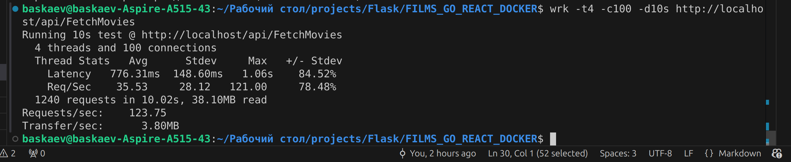
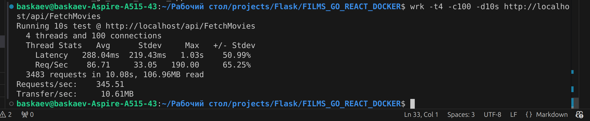

**Выполнил: Баскаев Т.О.**

**Назначение:** Парсинг IMDB, бесплатный просмотр фильмов

**Руководство Админа:**

Для запуска вам понадобится установленный докер, желательно запускать в убунту так как я в ней вел разработку, но можно и в винде запустить если установлен докер в системе. Также можно установить wsl и уже в ней скачать докер и запустить, особой разницы не должно быть так как все приложения запускаются изолированно в своих докер контейнерах. Еще должны быть свободными все нужные нам порты 8080, 80, 8082, 5432, 7317.

для запуска введите docker compose up --build (поднимет все контейнера)
для остановки введите docker compose down
для проверки состояния запущенных контейнеров введите docker ps (или docker ps -a)

прежде чем тестировать запустите localhost/api/AddTaskImdbParser чтобы у вас спарсились хоть какие-то фильмы для показа, по умолчанию там 100 фильмов. Этот запрос создаст задачу в таблице задач и TaskWorker ее выполнит в порядке очереди.

**Руководство пользователя:**

Перейдите на локальный хост для отображения сайта http://localhost/

**Короткое руководство программиста:**
(Немного о структуре проекта)

1. В проекте используется сервер обертка на nginx (чтобы не писать порт по типу localhost:8081)
2. На беке используется сервер на Пайтоне (фласк) (или на Go Echo по вашему выбору, надо просто поменять настройку докер компоуза). Сам сервер слушает 8082 порт на вашей машине.
3. На фронте используется Рекат в связке с сервером на nginx. Nginx нужен так как сбилженная версия реакт приложения это по сути тупо статические файлы.
4. В качестве бд используется постгрес.
5. Для доступа к бд можно использовать любой бд клиент на ваш выбор (рекомендую dbeaver).
   хост localhost
   порт 5432
   бд films_db
   пользователь user
   пароль password
6. По сути бэк в проекте раздельный, есть часть которая отвечает за работу с фильмами а есть часть которая отвечает за выполнения задач (допустим парсинг IMDB, эта часть доступна на го) - TaskWorker
7. Для парсинга imdb используется go ROD пакет, по сути это аналог силениума можно сказать, там также идет симулирование хрома и работа с драйвером хрома, только преимущество в том что все делается изолированно в своем контейнере
8. Для показа самих фильмов используется видео агрегатор https://kinobox.tv/

P.S. Будете тестить открывайте более-менее старые фильмы)))) для новых фильмов не всегда находится пиратское видео.

**Я сравнил на своей машине тесты сколько запросов обработает Flask и Echo:**

Если тоже хотите проверить на своей машине то установите wrk (для убунту это sudo apt install wrk) и затем запустите:
wrk -t4 -c100 -d10s http://localhost/api/FetchMovies

ссылка на версию где был чисто го https://github.com/baskaev/FILMS_GO_REACT_DOCKER

Внутри репозитория также находится **коллекция постмана**, можете потестить бэк своими запросами.
